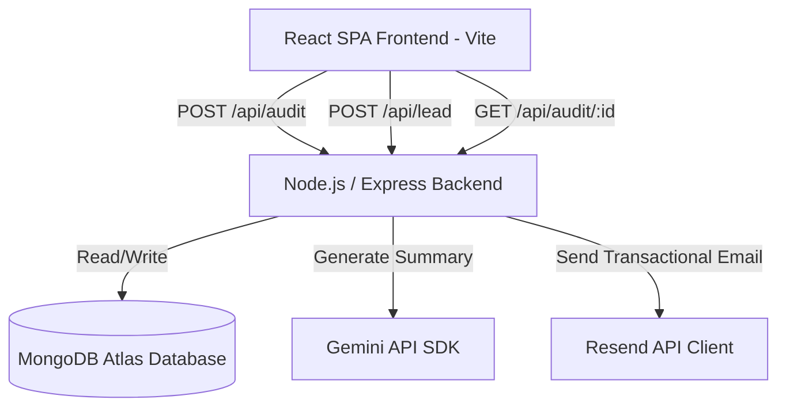

# System Architecture - AI Spend Audit

This document explains the architecture, data flow, tech stack, and scalability plans for the AI Spend Audit application.

## System Diagram

## Data Flow: Input to Audit Result

1. **User Input Form**: The user enters their current team size, use case, and AI tools they pay for.
2. **Local Persistence**: Frontend stores input states in `localStorage` so that refreshing doesn't wipe the inputs.
3. **API Submission**: The frontend POSTs the payload to `/api/audit`.
4. **Audit Calculations**: The backend's `auditEngine.js` programmatically processes the numbers using deterministic logic.
5. **AI Synthesis**: If the calculation succeeds, the backend formats the calculations and calls the Gemini API to generate a natural-language summary paragraph.
6. **Persistence**: The backend saves the audit (original total, recommended total, breakdown, AI summary) in MongoDB, generating a unique ID.
7. **Lead Gate**: The results page renders. The user is prompted to input their email. Upon entry, the client POSTs the email and audit ID to `/api/lead`.
8. **Email Confirmation**: The backend updates the record in MongoDB, triggers an email via Resend, and returns a success response.
9. **Viral Loop**: The user can copy a public shareable URL (`/audit/:id`). When visited, the client requests the audit details by ID, leaving all user-identifying info (emails, names) hidden.

---

## Tech Stack Justification

1. **Frontend**: React (Vite-powered SPA) with Tailwind CSS. Vite gives fast hot-module replacement and simple static bundling.
2. **Backend**: Node.js and Express. It provides a lightweight, scalable, and highly customizable routing layer.
3. **Database**: MongoDB (via Mongoose). A NoSQL document database fits this data shape perfectly because audits are structured documents containing arbitrary lists of tools.
4. **Language**: Plain JavaScript (ES6 Modules). Chosen for compatibility and speed, satisfying standard MERN configurations.

---

## Scaling to 10k Audits/Day

If traffic scales to 10,000 audits/day, we would adopt the following optimizations:

1. **Caching Layer**:
   - Integrate **Redis** to cache GET requests for shareable audits (`/api/audit/:id`). Since audit reports are static once created, fetching them from memory saves database load.
2. **Queue-Based Email Processing**:
   - Shift Resend email dispatches to a background job queue (e.g., **BullMQ** with Redis or AWS SQS). This prevents email API latency from blocking Express request cycles.
3. **LLM Rate-Limiting & Buffering**:
   - Store popular audit combinations or cache common prompts. Implementing fallback summarization engines (or local lightweight LLM workers) prevents running out of API quotas during spike loads.
4. **Database Read Replicas**:
   - Utilize MongoDB Atlas scaling with read replicas to separate read queries (public sharing pages) from write transactions (new audits/leads).
5. **CDN Deployment**:
   - Host the React frontend on a Global Content Delivery Network (CDN) like Vercel or Cloudflare Pages, offloading frontend asset serving from our Node.js servers entirely.
