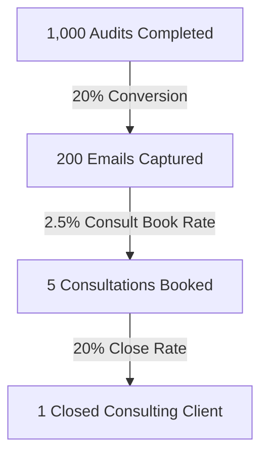

# AI Spend Audit - Unit Economics & Monetization Plan

This document details the financial modeling, lead valuation, customer acquisition cost (CAC), and path to $1M ARR for Techvruk using this audit tool.

---

## 1. Valuation of a Converted Lead to Techvruk
Techvruk is an AI engineering and infrastructure consultancy. A converted client represents a consulting contract.
- **Average Project Value**: $15,000 (standard AI implementation project or infrastructure migration).
- **Average Client Lifetime Value (LTV)**: $45,000 (retaining the client for ~3 projects over 24 months).
- **Gross Profit Margin**: 70% (developer labor costs).
- **Gross Profit LTV**: $31,500.

Therefore, we can value a **Converted Consulting Client** at **$31,500** in net value.

---

## 2. Customer Acquisition Cost (CAC) by Channel

Our GTM plan targets free channels, but developer time has costs. We calculate fully-loaded CAC below:

| Channel | Monthly Labor Cost | Estimated Monthly Leads | Fully-Loaded CAC |
| :--- | :--- | :--- | :--- |
| **X (Twitter) Outbound** | $500 (10 hrs/mo virtual assistant) | 15 leads | **$33.33** |
| **Hacker News (HN)** | $200 (founder writing post) | 40 leads | **$5.00** |
| **Fractional CFO Partner** | $1,000 (BD outreach setup) | 50 leads | **$20.00** |

Average blended CAC per Lead captured: **$17.14**.

---

## 3. Funnel & Profitability Conversion Mathematics

To break even on the program costs, we require the following conversion metrics:

### The Math:
- **Cost of 1,000 Audits**:
  - LLM Summary Cost: 1,000 × $0.001 (Claude 3.5 Haiku) = $1.00.
  - Hosting: $15.00/mo (Render).
  - Average CAC for 200 Leads: 200 × $17.14 = $3,428.00.
  - *Total Cost*: **$3,444.00**.
- **Revenue of 1,000 Audits**:
  - 1 Closed Client = **$15,000.00** (revenue) or **$31,500.00** (LTV).
- **ROI**:
  - **4.35x ROI** on raw revenue, or **9.14x ROI** on LTV basis.
  - The program is highly profitable even at a conservative **0.1% overall conversion rate** (Audits Completed → Closed Clients).

---

## 4. The Path to $1M ARR in 18 Months
To drive $1M in Annual Recurring Revenue (ARR) within 18 months, Techvruk needs to generate $83,333 in monthly billings.

Assuming a blended consulting/retention retainer model of **$5,000/month per startup client**, we require **17 active retainer clients** concurrently.

### Monthly Volume Required:
- Active clients needed: 17
- Average customer retention duration: 12 months (implies we must acquire ~1.5 new clients/month).
- With a **0.5% conversion rate** from Captured Leads → Retainer Client:
  - We require **300 captured leads/month**.
- With a **20% Lead Capture Conversion Rate**:
  - We require **1,500 completed audits/month** (~50 audits/day).

This is a highly achievable target. Fifty audits/day can be driven entirely by our Fractional CFO channel partnerships and one recurring viral post per month.
